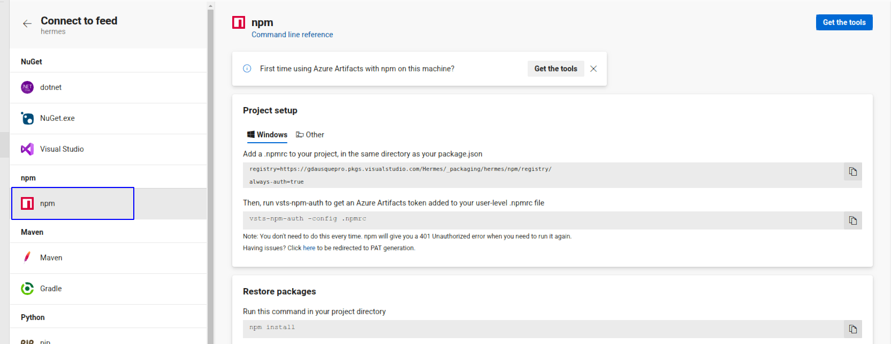

[Home](./Home.md) > [Composition](HomeComposition.md)

# Hermes Frameworks - Composition : All Resources
>All resources from Source code for composition, including example 

## What it does

The composition package of the Hermes Frameworks project introduce a standard factory pattern in a nodejs server that helps compose an
application based on metadata worn by any class implementation, and that help developers focus on contract and not on
implementation.

It allows you to develop an application using plugins, making easier the extension of your application by coding only the
leaf element of your process chain, avoiding the need of any modifications of it.

## Installation

A npm package is available to make installation easiest as possible, even for a frontend web page.

### Configuration of the registry

First you need to be autorize as a reader of the Hermes Frameworks project. If you are not at least readers, please contact : 

[gabrieldausque.pro@gmail.com](mailto:gabrieldausque.pro@gmail.com)

Then you will need to add the Hermes Frameworks registry. A complete tutorial is available in *npm* section : [click here](https://gdausquepro.visualstudio.com/Hermes/_packaging?_a=connect&feed=hermes)



In summary, create a .npmrc file if you do not have one next to your package.json file, and add following npm scoped registry:

```
registry=https://registry.npmjs.org
@hermes:https://gdausquepro.pkgs.visualstudio.com/Hermes/_packaging/hermes/npm/registry/ 

always-auth=true
```   

Obtain a Personal Access Token for azure devops, by following this steps: 

Connect to the personal access tokens forms:

[https://gdausquepro.visualstudio.com/_usersSettings/tokens](https://gdausquepro.visualstudio.com/_usersSettings/tokens)

Create a new token with maximum durability you want : 


Copy the value, and encode it in base64 using following command :

 ```
 node -e "require('readline') .createInterface({input:process.stdin,output:process.stdout,historySize:0}) .question('PAT> ',p => { b64=Buffer.from(p.trim()).toString('base64');console.log(b64);process.exit(); })"
 ```

In your user .npmrc file (in %USERPROFILE%\.npmrc for windows and ~/.npmrc for linux system), add following lines :

```
; begin auth token
//gdausquepro.pkgs.visualstudio.com/Hermes/_packaging/hermes/npm/registry/:username=gdausquepro
//gdausquepro.pkgs.visualstudio.com/Hermes/_packaging/hermes/npm/registry/:_password=[BASE64_ENCODED_PERSONAL_ACCESS_TOKEN]
//gdausquepro.pkgs.visualstudio.com/Hermes/_packaging/hermes/npm/registry/:email=npm requires email to be set but doesn't use the value
//gdausquepro.pkgs.visualstudio.com/Hermes/_packaging/hermes/npm/:username=gdausquepro
//gdausquepro.pkgs.visualstudio.com/Hermes/_packaging/hermes/npm/:_password=[BASE64_ENCODED_PERSONAL_ACCESS_TOKEN]
//gdausquepro.pkgs.visualstudio.com/Hermes/_packaging/hermes/npm/:email=npm requires email to be set but doesn't use the value
; end auth token
```

Replace terms in [] with the right value (don't forget the PAT value encode in base64 !)

**<u>NB :</u>** the username to use is indicated in the [official tutorial](https://gdausquepro.visualstudio.com/Hermes/_packaging?_a=connect&feed=hermes)

### Installation

Run npm command to install dependencies:

```
npm install @hermes/composition --save
```

Now to compose your application, you will need to load your "plugins" classes from a directory : 

- by using the globalInstancesFactory, can be used as a global factory :

``` ts
import {globalInstancesFactory} from '@hermes/composition';

globalInstancesFactory.loadExportedClassesFromDirectory(__dirname + '/services/');

const instance = globalInstancesFactory.getInstanceFromCatalogs('MyContract', 'implementation')

```

- by using your own InstancesFactory, on which you control the exposition scope :

```
import {InstancesFactory,globalInstancesFactory} from '@hermes/composition';

const factory = new InstancesFactory();

const instance = factory.getInstanceFromCatalogs('MyContract', 'implementation')

```

## Resources :

[Code Reference](/Composition/Reference/modules.md)

