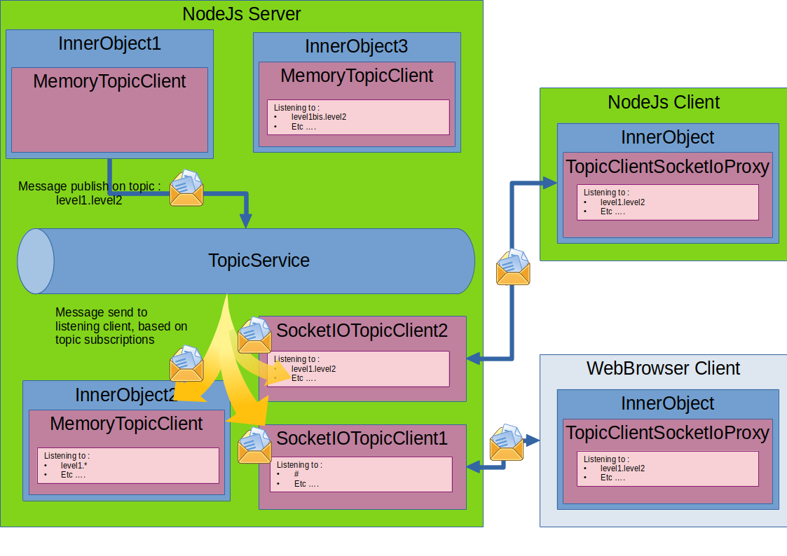
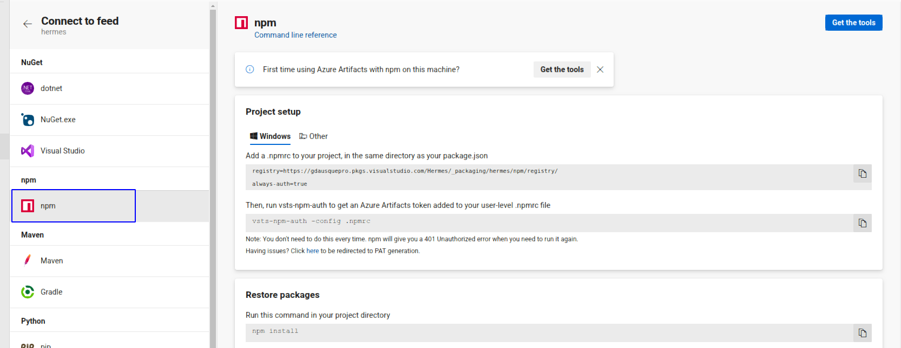
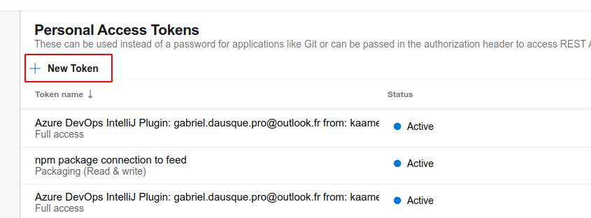
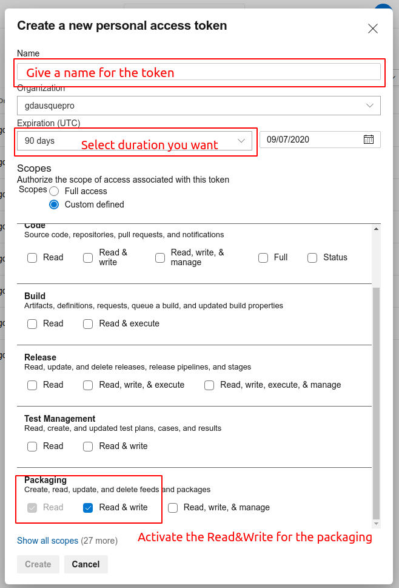
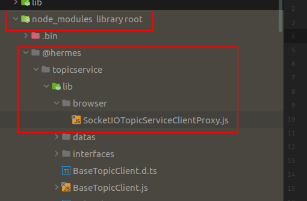
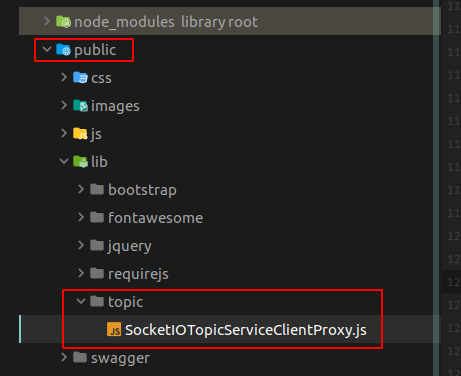

[Home](./README.md)

# Hermes - TopicService : All Resources
>All resources from Source code, including example 

## What it does

The topic service of the Hermes project introduce a publish/subscribe pattern in a nodejs server with distant and nearby client. 
It allows lazy coupled communication by message between object or method or distant client (using socket.io). 
It uses also a hierarchical structure for the topic message that allows multicasting/broadcasting message to unknown subscribers.

The below schema explain what you can do with topic service : 



## Installation

A npm package is available to make installation easiest as possible, even for a frontend web page.

### Configuration of the registry

First you need to be autorize as a reader of the Hermes project. If you are not at least readers, please contact : 

[gabrieldausque.pro@gmail.com](mailto:gabrieldausque.pro@gmail.com)

Then you will need to add the Hermes registry. A complete tutorial is available in *npm* section : [click here](https://gdausquepro.visualstudio.com/Hermes/_packaging?_a=connect&feed=hermes)



In summary, create a .npmrc file if you do not have one next to your package.json file, and add following npm scoped registry:

```
registry=https://registry.npmjs.org
@hermes:registry=https://gdausquepro.pkgs.visualstudio.com/Hermes/_packaging/hermes/npm/registry/
always-auth=true
```   

Obtain a Personal Access Token for azure devops, by following this steps: 

Connect to the personal access tokens forms:

[https://gdausquepro.visualstudio.com/_usersSettings/tokens](https://gdausquepro.visualstudio.com/_usersSettings/tokens)

Create a new token with maximum durability you want : 





Copy the value, and encode it in base64 using following command :

 ```
 node -e "require('readline') .createInterface({input:process.stdin,output:process.stdout,historySize:0}) .question('PAT> ',p => { b64=Buffer.from(p.trim()).toString('base64');console.log(b64);process.exit(); })"
 ```

In your user .npmrc file (in %USERPROFILE%\.npmrc for windows and ~/.npmrc for linux system), add following lines :

```
; begin auth token
//gdausquepro.pkgs.visualstudio.com/Hermes/_packaging/hermes/npm/registry/:username=[your username]
//gdausquepro.pkgs.visualstudio.com/Hermes/_packaging/hermes/npm/registry/:_password=[BASE64_ENCODED_PERSONAL_ACCESS_TOKEN]
//gdausquepro.pkgs.visualstudio.com/Hermes/_packaging/hermes/npm/registry/:email=[an email]
//gdausquepro.pkgs.visualstudio.com/Hermes/_packaging/hermes/npm/:username=[your username]
//gdausquepro.pkgs.visualstudio.com/Hermes/_packaging/hermes/npm/:_password=[BASE64_ENCODED_PERSONAL_ACCESS_TOKEN]
//gdausquepro.pkgs.visualstudio.com/Hermes/_packaging/hermes/npm/:email=[an email]
; end auth token
```
Replace terms in [] with the right value (don't forget the PAT value encode in base64 !)

**<u>NB :</u>** the username to use is indicated in the [official tutorial](https://gdausquepro.visualstudio.com/Hermes/_packaging?_a=connect&feed=hermes)

### Installation for Server side

Run npm command to install dependencies:

```
npm install @hermes/topicservice --save
```

Now, to use the topic service, declare a shared instance (a service) of TopicService (to use it accross all your script) : 

``` ts
import {TopicService, MemoryTopicServiceClient, TopicMessage} from '@hermes/topicservice';
const topicService = new TopicService();

const client1 = new MemoryTopicServiceClient(topicService);
const client2 = new MemoryTopicServiceClient(topicService);
client1.subscribe('atopic', (topic:string, topicMessage:TopicMessage) =>{
       console.log("a message has been received");
       console.log(topicMessage);
}, null);

client2.publish('atopic', "A content");

```
At execution, this will result in this display

``` json
a message has been received
{
  createdAt: 1586506633766,
  senderId: '85ee5174-f321-42ce-9501-0081df97e21e',
  content: 'A content',
  fromTopic: 'atopic',
  listenedTopic: 'atopic'
}
```

### Installation for client side (Browser)

 Run npm command to install dependencies:
 
 ```
npm install @hermes/topicservice --save
```

Copy the file SocketIOTopicServiceClientProxy.js to your javascript resource file : 

 From : 
 
 
 
 To : 
 
 

In your html file, add socket.io dependency : 

``` html
 <script src="//cdnjs.cloudflare.com/ajax/libs/socket.io/2.0.4/socket.io.js"></script>
```

Add also your script include as a module : 

 ``` html
 <script type="module" src="js/myscript.js"></script> 
 ```

In your JS file, import following class :
``` js
import {SocketIOTopicServiceClientProxy} from "../lib/topic/SocketIOTopicServiceClientProxy.js";
```
After initializing a socket object from socket.io, you can create your client instance :
``` js
const socket = io(window.location.href);
const topicClient = new SocketIOTopicServiceClientProxy(socket);
```
To start listening to event, you must wait that the client is ready. If you have not setup the handler in the constructor, you can do following :
``` js
  topicClient.ready(() => {
    topicClient.subscribe('global.project_created', (topic, topicMessage) => {
      displayNotification("ProjectEntity Created", "The project with id " + topicMessage.content.id + " has been created")
    });
```
You can now react to any event published on server side if you listen to the right topic !

## Resources :

[Horizontal Scaling And Cluster Mode](/HorizontalScaling)

[Examples](/Examples)

[Code Reference](/Reference)

