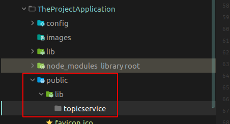

# The Project Application

> This application is an application that allows users to create projects that can contains some 
child molecules.
> 
> When creating project, two events occured :
> - all users are notified of the creation of a new object
> - a background service is informed of the creation of the project and add two random molecules to it
>
> The creator of the project is automatically informed when a molecule is added to the created project
> Other users can follow additions of molecules of created project by other users.

## Composition of the Application

This application is a featherjs application ([feathers documentation](https://feathersjs.com/)) in typescript, using socket.Io for realtime.

It will need only the @hermes/topicservice package.

### Creation of the project
 
Install the featherjs cli globally
``` bash
npm install @feathersjs/cli -g
```
Generate the app skeleton 
 ``` bash
 ./node_modules/.bin/feathers generate app
 ```
The following input are chosen :
>
><p><span style="color:green">?</span> Do you want to use JavaScript or TypeScript? <span style="color:blue">TypeScript</span></p>
><p><span style="color:green">?</span> Project name <span style="color:blue">the-project-application </span></p>
><p><span style="color:green">?</span> Description <span style="color:blue">The Project Application Demo </span></p>
><p><span style="color:green">?</span> What folder should the source files live in? <span style="color:blue">src </span></p>
><p><span style="color:green">?</span> Which package manager are you using (has to be installed globally)? <span style="color:blue">npm </span></p>
><p><span style="color:green">?</span> What type of API are you making? (Press <space> to select, <a> to toggle all, <i> to invert selection)<span style="color:blue">REST, Realtime via Socket.io </span></p>
><p><span style="color:green">?</span> Which testing framework do you prefer? <span style="color:blue">Mocha + assert </span></p>
><p><span style="color:green">?</span> This app uses authentication <span style="color:blue">No </span></p>

Add the hermes repository, by following [this tutorial](/README#Installation for Server side), and install the @hermes/topicservice package.
``` bash
 npm install @hermes/topicservice --save
```
Modify the tsconfig.json as following : 

``` json
{
  "compilerOptions": {
    "target": "ES6",
    "module": "commonjs",
    "outDir": "./lib",
    "rootDir": "./src",
    "strict": false,
    "esModuleInterop": true,
    "sourceMap": true
  },
  "exclude": [
    "test"
  ]
}
```
install ncp as dev dependency 

``` bash
npm install ncp
```
Create the following directory :



Modify the package.json to add distant client script to public directory :
``` json
  ...
  "scripts": {
    ...
    "compile": "shx rm -rf lib/ && tsc && node_modules/.bin/ncp node_modules/@hermes/topicservice/lib/browser/ public/lib/topicservice/"
    ...
  },
  ...
```

### Integration of TopicService 

#### In the feather app

Declare an interface for the app in the declaration.d.ts file and make ApplicationType inherits from it : 

``` typescript
import { TopicService} from '@hermes/topicservice'
export class ProjectApp {
  topicService?:TopicService;
}

// The application instance type that will be used everywhere else
export type Application = ExpressFeathers<ServiceTypes> & ProjectApp;
```

In the app.ts, instanciate the TopicService, and add the connect handler to socket.Io to create new client when needed.

``` typescript
const app: Application = express(feathers());

// Load app configuration
app.configure(configuration());
...

//topic management, must be load after configuration :
app.topicService = new TopicService();
...

app.configure(socketio((io) => {
  io.on('connection', (socket) => {
    const topicClient = new SocketIOTopicServiceClient(app.topicService, socket);
  })
}));

``` 

#### In a feather service without client (no subscription needed)
 
In a feather created service, you may just want to publish a notification on specific actions. 

To do that, you don't need a client to publish message, as you have direct access to the topicservice instance.

In the <service>.class.ts file, in the action method, for example here in the create action, just call the publish method as this with the right args: 

``` typescript
async create (data: Data, params?: Params): Promise<any> {
    if (Array.isArray(data)) {
      return Promise.all(data.map(current => this.create(current, params)));
    }
    let project = this.app.backend.createProject(ProjectEntity.loadFromDto(data));
    const newProject = ProjectDto.createFromEntity(project);
    this.app.topicService.publish("global.project_created", project).catch((error) => {
      console.error("error in create : " + error);
    });
    return newProject;
  }
```

#### In a feather service with a client (subscriptions needed)

Whatever the method you chose, you need a client in the service. To do that, I recommend to have this signature for the constructor : 

``` typescript
...
export class MoleculeLoader {
  private topicClient: ITopicClient;
  private backendService: BackEndService;
  constructor(topicClient:ITopicClient, backendService:BackEndService) {
...
```
That allow you to inject a mock or anything in your tests for this service. 

In the app.ts file, just do this : 

``` typescript
...
app.backend = new BackEndService();
app.moleculeLoader = new MoleculeLoader(new MemoryTopicServiceClient(app.topicService), app.backend);
...
```

In the constructor, you will subscribe to any event you want to listen to, here, the global.project_created, and a RPC event, to add molecule on demand (from the client) event to load molecule in it : 

``` typescript
...
constructor(topicClient:ITopicClient, backendService:BackEndService) {
    this.topicClient = topicClient;
    this.backendService = backendService;
    this.topicClient.subscribe('global.project_created', this.loadMolecules, this);
    this.topicClient.subscribe('global.project_addmolecule', this.addMolecule, this);
  }
...
```

The handler must respect the TopicHandlerFunction signature, the first arg will be the topic received, the second one a TopicMessage that will contain the content and some metadatas about the message (who send it, what was the listened topic that trigger it, the send topic that trigger it, the send date, etc ...)

For example, the loadMolecules, that load two random molecules for any Project created : 

``` typescript
private async loadMolecules(topicTriggered:string, topicMessage:TopicMessage) {
    const content = topicMessage.content as ProjectEntity;
    const project:ProjectEntity = this.backendService.getProject(content.id.toString());
    const currentService = this;
    setTimeoutPromise(1000, project).then(this.addRandomMolecule.bind(currentService));
    setTimeoutPromise(3000, project).then(this.addRandomMolecule.bind(currentService))
  }
```

#### In the client side

> Prerequiresite 
> To ensure messages will be received or sent through socket.Io, don't forget in the app, to subcribe to connect event and create the serverside object for the client :
> in the app.ts, do this : 

``` typescript
...
app.configure(socketio((io) => {
  io.on('connection', (socket) => {
    const topicClient = new SocketIOTopicServiceClient(app.topicService, socket);
  })
}));
...
```

In the html page, add references to your script as a module, and also to socketio : 

``` html
  <head>
    <title>Hermes API Demo</title>
    <meta name="description" content="A FeathersJS server">
    <meta name="viewport" content="width=device-width, initial-scale=1">
    <script type="text/javascript" src="lib/jquery/jquery-3.4.1.min.js"></script>
    <link rel="stylesheet" href="lib/bootstrap/css/bootstrap.min.css"/>
    <script type="text/javascript" src="lib/bootstrap/js/bootstrap.min.js"></script>
    <link rel="stylesheet" href="lib/fontawesome/css/all.min.css" type="text/css"/>
    <link rel="stylesheet" href="css/site.css"/>
    <script src="//unpkg.com/@feathersjs/client@^4.3.0/dist/feathers.js"></script>
    <script src="//cdnjs.cloudflare.com/ajax/libs/socket.io/2.0.4/socket.io.js"></script>
    <script type="module" src="js/site.js"></script>
  </head>
```
 
 In your script, make the right import : 
 
 ``` javascript
 import {SocketIOTopicServiceClientProxy} from "../lib/topic/SocketIOTopicServiceClientProxy.js";
 ```

Create the Io socket, and instantiate the client. 

<span style="color:red">Beware !!! You can't subscribe just after instantiation to anything as the client as not received the connection ack from the server. If you need to subscribe as quick as possible, use the ready handler (second argument of the constructor)</span>  : 
``` javascript
const socket = io(window.location.href);
const topicClient = new SocketIOTopicServiceClientProxy(socket, () => {
  topicClient.subscribe('global.project_created', (topic, topicMessage) => {
    displayNotification("ProjectEntity Created", "The project with id " + topicMessage.content.id + " has been created")
  }).then(() => {
  });

  topicClient.subscribe('global.project_created', (topic, topicMessage) => {
    displayProjectCard(topicMessage);
  }).then(() => {
  });
});
```

##### how to subscribe

If you need to make a subscription after, during your application life cycle, you just need to call the subscribe method : 

``` javascript
function subscribeToCreatedProjectMoleculeLoadedEvent(createdProjectId) {
  topicClient.subscribe(createdProjectId + '.molecule_loaded', (topic, topicMessage) => {
    displayNotification("ProjectEntity molecule Loaded", "a molecule has been added to the project " + topicMessage.content.id);
    displayMolecules(topicMessage);
  })
}
```

**NB :** The subscrition handler must respect the TopicHandlerFunction signature.

##### how to unsubscribe 

To unsubscribe to a topic. You need to call the unsubscribe method with the topic as arg (here from the data-subscription attribute) : 

``` javascript
jQuery(document).on('click', '#subscriptions-list > li > button',(e) => {
    const btn = jQuery(e.currentTarget);
    topicClient.unSubscribe(btn.attr('data-subscription'));
    window.setTimeout(() => {
      jQuery('#manage-subscription-button').trigger('click');
    }, 1000);
  })
```

**NB :** There is no way to unsusbcribe only one handler for a specific topic, the unsubscribe process is done for all handler.

##### how to publish 

To publish a message, if you want to publish to exactly one topic : 

 ``` javascript 
 jQuery(document).on('click', 'button.addmolecule', (event) => {
    const currentButton = jQuery(event.currentTarget);
    const projectId = currentButton.attr('data-projectid');
    topicClient.publish('global.project_addmolecule', projectId);
  });
```

To multicast a message, for example you want to publish to all subscribers listening to a specific sublevel, just do :

``` javascript
topicClient.publish("level1.*.level3", " a message")
```

the wildcard * is for all word in this level

You can also use the wildcard #, which will publish to all child of a level, including subchild : 
``` javascript
topicClient.publish("level1.#", " a message")
```

To broadcast a message, just publish :

``` javascript
topicClient.publish("#", " a message")
```


 


  

 


 


 
 
 
 
